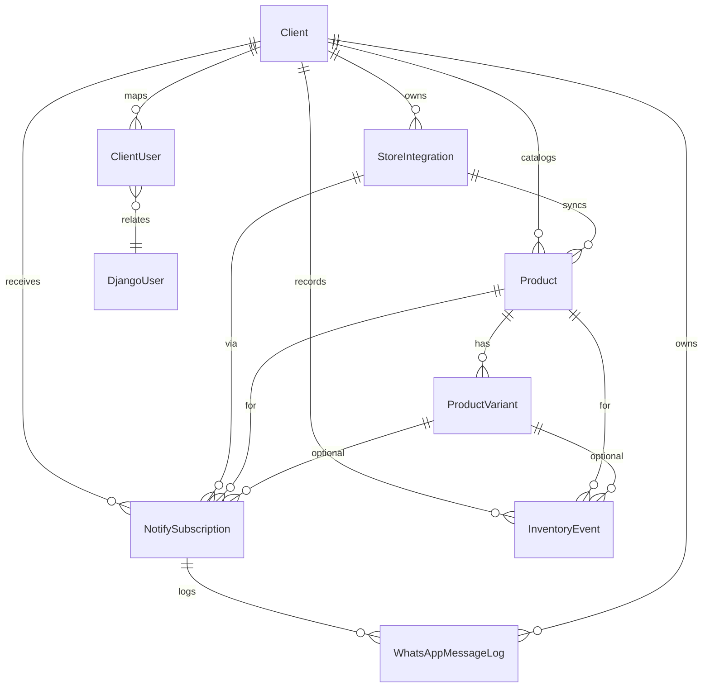

# NotifyMe SaaS (Django MVP)

Multi-tenant MVP for collecting "notify me" requests when products are out of stock and sending WhatsApp utility messages once inventory is replenished.

## System Flow
```mermaid
flowchart TD
    A[Customer on Client Product Page] --> B[Clicks "Notify Me on WhatsApp"]
    B --> C[Submit WhatsApp number + variant]
    C --> D[POST /api/notify-subscribe]
    D --> E[Save NotifySubscription (PENDING) in DB]
    F[Inventory Webhook from Shopify/API] --> G[InventoryEvent created]
    G --> H{prev qty 0 and new qty > 0?}
    H -- Yes --> I[Fetch PENDING subscriptions]
    I --> J[Generate WhatsApp utility message]
    J --> K[Send via WhatsApp provider]
    K --> L[Create WhatsAppMessageLog]
    L --> M[Mark subscription NOTIFIED]
    M --> N[Client Dashboard stats update]
    L --> O[Platform Admin views global logs]
```

## ERD


## Project Structure
```
notifyme_saas/
  manage.py
  requirements.txt
  notifyme_saas/
    __init__.py
    settings.py
    urls.py
    wsgi.py
  accounts/
    __init__.py
    models.py
    mixins.py
  clients/
    __init__.py
    models.py
  catalog/
    __init__.py
    models.py
  subscriptions/
    __init__.py
    apps.py
    models.py
    serializers.py
    services.py
    signals.py
    urls.py
    views.py
  integrations/
    __init__.py
    urls.py
    webhooks.py
    whatsapp_client.py
  dashboards/
    __init__.py
    urls.py
    views.py
    templates/dashboards/
      client_dashboard.html
      admin_dashboard.html
      widget_snippet.html
```

## Key Django Files

### `notifyme_saas/settings.py`
- Configures Django 4.2, DRF, installed apps, SQLite DB, static files, and template directories.

### `subscriptions/services.py`
- Builds WhatsApp utility message and handles notification dispatch when inventory flips from 0 to >0.

### `integrations/webhooks.py`
- Shopify inventory webhook with HMAC validation, mapping payload to `InventoryEvent`, which triggers notifications via signals.

### `dashboards/views.py` & templates
- Client dashboard scoped to tenant with counts and subscription table.
- Platform admin dashboard with cross-tenant insights and recent WhatsApp logs.

### `dashboards/templates/dashboards/widget_snippet.html`
- Embeddable HTML/JS snippet for "Notify me" capture that POSTs to `/api/notify-subscribe/`.

## WhatsApp Utility Message Example
Built in `subscriptions/services.build_whatsapp_message`:
```
Salam [CustomerName], your requested product [ProductName] is back in stock. Tap here to order now: [ProductURL] – This is an automated notification from [ClientName].
```

## How Multi-Tenancy Is Enforced
- All tenant-owned models include a `client` FK. Querysets in dashboards use `ClientScopedQuerysetMixin` to restrict data to the logged-in user's client unless the user is a Django superuser (platform admin).
- API validation maps incoming client/store identifiers to the correct tenant and integration before saving.

## Shopify Webhook Mapping
- Expects headers `X-Shopify-Shop-Domain` and `X-Shopify-Hmac-Sha256`.
- Payload fields `product_id`, `variant_id`, `previous_qty`, and `available` are read and stored as an `InventoryEvent` tied to the correct client/product/variant.
- HMAC verification uses the integration's `webhook_secret`.

## WhatsApp Provider Integration (Meta Cloud API stub)
- `WhatsAppClient.send_message` builds the POST to `https://graph.facebook.com/v18.0/{phone_number_id}/messages` with text payload and bearer token.
- For the MVP, the call is stubbed to return a demo response, but it is structured for a drop-in real request (uncomment the `requests.post` section).

## Running the Project
1. `cd notifyme_saas`
2. `python -m venv .venv && source .venv/bin/activate`
3. `pip install -r requirements.txt`
4. `python manage.py migrate`
5. `python manage.py runserver`

## What you can see in the frontend today
- Customer widget: open `dashboards/templates/dashboards/widget_snippet.html` to copy the embeddable "Notify me on WhatsApp" form that POSTs to `/api/notify-subscribe/` via fetch. Once Django is running, you can render it by including `` inside any template.
- Client dashboard: available at `/dashboard/` for authenticated client users; it lists products, pending/notified counts, and recent subscriptions for the tenant.
- Platform admin dashboard: available at `/admin-dashboard/` for superusers; it aggregates client counts, subscriptions, and WhatsApp message logs across tenants.

